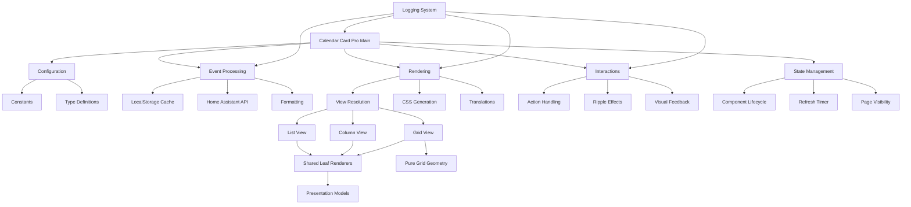

# Calendar Card Pro Architecture

This document provides a high-level overview of the Calendar Card Pro architecture, explaining how different modules work together to create a performant and maintainable calendar card for Home Assistant.

## 🗂️ Directory Structure

```text
src/
├── calendar-card-pro.ts          # Main entry point and component class
├── config/                       # Configuration-related code
│   ├── config.ts                 # DEFAULT_CONFIG and config helpers
│   ├── constants.ts              # Application constants and defaults
│   ├── types.ts                  # TypeScript interface definitions
│   └── view.ts                   # List/Column/Grid blocks, defaults, density, fallback
├── interaction/                  # User interaction handling
│   ├── actions.ts                # Action execution (tap, hold, etc.)
│   └── feedback.ts               # Visual feedback (ripple, hold indicators)
├── rendering/                    # UI rendering code
│   ├── editor/                   # Schema-driven configuration editor (its own bundle)
│   │   ├── index.ts              # Build entry and public surface of the editor
│   │   ├── element.ts            # The Lit element: lifecycle, forms, editor state
│   │   ├── panels.ts             # Panel registry and schema context
│   │   ├── schemas/              # One module per panel, plus their shared vocabulary
│   │   ├── ha-form.ts            # Our declaration of Home Assistant's schema shape
│   │   ├── value.ts              # Serialization, legacy migration, authored-value retention
│   │   ├── entities.ts           # Write path for the per-calendar list
│   │   ├── exceptions.ts         # Removes stored view overrides for Reset controls
│   │   ├── subforms.ts           # The schemas a panel renders outside its own form
│   │   ├── filter.ts             # Search and "customized only"
│   │   ├── workspace.ts          # Editor-only All Layouts/List/Column/Grid selection
│   │   ├── routing.ts            # Workspace projections and scope-captured writes
│   │   ├── normalize.ts          # Comparable root and nested form values
│   │   ├── synthetic.ts          # UI-only fields, and values invalid while typed
│   │   ├── localize.ts           # The string hooks `ha-form` calls
│   │   ├── strings.ts            # English editor strings
│   │   ├── version.ts            # Build-stamped version the editor reports
│   │   ├── translations/         # The same keys per language, partial by design
│   │   └── styles.ts             # Editor chassis CSS
│   ├── render.ts                 # Card shell and the list view
│   ├── column.ts                 # The column view
│   ├── grid.ts                   # The timed grid and spanning all-day band
│   ├── leaves.ts                 # Leaf renderers shared across the three views
│   ├── presentation.ts           # Layout-independent per-event presentation models
│   └── styles.ts                 # CSS styles and dynamic styling
├── translations/                 # Localization support
│   ├── dayjs.ts                  # Day.js locale configuration
│   ├── localize.ts               # Translation functions
│   └── languages/                # Translation files (35 supported languages)
│       ├── en.json               # English translations
│       ├── de.json               # German translations
│       └── ...                   # Other language files
└── utils/                        # Utility functions
    ├── events.ts                 # Calendar event fetching and processing
    ├── grid.ts                   # Pure time-grid geometry, overlap lanes, banner spans
    ├── format.ts                 # Date and text formatting
    ├── start-date.ts             # The `start_date` relative-date grammar
    ├── helpers.ts                # Generic utilities (color, ID generation)
    ├── logger.ts                 # Logging system
    ├── templates.ts              # Jinja2 title templates over the HA websocket
    ├── editor-url.ts             # Where the editor file lives, relative to the card
    ├── weather.ts                # Weather data fetching and processing
    └── weather-i18n.ts           # Condition text in the card's language
```

## 🧭 Three Views, One Agenda

The card renders the same agenda in one of three layouts, and this is the structural fact
most worth holding on to before changing anything under `rendering/`:

- **`view: list`** stacks days vertically, each day a row. This is what the card has
  always done and remains the default.
- **`view: column`** lays days side by side, one column each.
- **`view: grid`** positions timed events against a shared hour axis, with all-day events
  in a separate band above it.

They share the card shell, event pipeline, and presentation models rather than duplicating
the card. `leaves.ts` holds reusable date, event-content, weather, and indicator renderers;
`presentation.ts` computes layout-independent event details. `render.ts`, `column.ts`, and
`grid.ts` arrange those pieces. Grid also uses the pure geometry in `utils/grid.ts` for
wall-clock placement, overlapping lanes, and multi-day banner spans.

The effective view can change with available width. Column and Grid can fall back to List
or retain their side-by-side layout with horizontal scrolling, according to their density
options. Grid's width calculation also reserves the hour gutter. `config/view.ts` owns
this resolution and its hysteresis, so resizing does not repeatedly flip layouts at a
boundary. The editor workspace is separate: choosing List exposes its controls without
changing the displayed layout.

## 🧱 Configuration Layers & Editor Adoption

The top level is the shared base. `list:`, `column:`, and `time_grid:` hold presentation
values for their own views; calendars, fetching, language, actions, and other card-wide
options stay at the top level. For a shared view option, both `resolveViewOption` and
`resolveEffectiveConfig` apply the same order: explicit view override, built-in divergent
view default, shared value. List has no divergent defaults. View-only options use their
own block defaults, with permanent root fallback for the legacy List-only options.

The editor exposes four destinations: **All Layouts** writes roots, and **List**,
**Column**, and **Grid** write their blocks. `workspace.ts` distinguishes the destination
from the view used to build panel structure. All Layouts uses List-shaped panels, but
conditional controls resolve shared values, never `list:` overrides. `routing.ts`
captures the destination with each rendered form so a delayed event cannot write into a
different workspace.

`config_version: 5` records editor adoption; it is not a renderer precedence switch.
`configVersionState` classifies missing or older nonnegative integer markers as legacy,
accepts the current version, and blocks visual-editor writes for future or malformed
versions. It does not coerce a string such as `'5'` into a number.

For an ambiguous legacy List or Grid card, the editor waits for the user's interpretation
of authored divergent roots. **Keep my existing List appearance** moves them into
`list:`; **Use these settings for all layouts** keeps them shared. Both move List-only
roots into `list:`, preserve explicit block values, and stamp the format. Legacy Column,
unambiguous cards, and versionless configurations already carrying `list:` or `time_grid:`
adopt on the first real edit without that prompt. Opening alone emits no configuration.

Authorship is captured from raw input before defaults are merged. Migration uses those raw
values, including `false`, zero, and default-equal values; local editor state is updated
before forms reopen or Home Assistant echoes the save. Serialization retains explicit
divergent shared roots so reopening does not lose a choice that a later Grid transition
must preserve. Implicit defaults remain absent. A transition to Grid may copy those roots
into `time_grid:`; that editor reconciliation does not run when loading YAML.

See [Per-View Options](/features/core-settings#per-view-options) and the
[editor upgrade flow](/features/editor#upgrading-a-card-from-before-v5) for user-facing
examples.

## 📦 Two Files, One Card

The build emits **two** self-contained bundles into a flat `dist/`:
`calendar-card-pro.js` and `editor.js` (`-dev` suffixed in development builds). The card
fetches the editor only when someone opens it, which keeps the editor and all of its
translations off every dashboard load.

Neither file imports the other. The card names the editor through a URL it computes at
runtime (`utils/editor-url.ts`), which is invisible to both module graphs — a plain
dynamic `import()` would make Rollup emit a shared chunk that the editor imports back
from the card, and the query string HACS appends to the card's own URL would make the
browser treat that as a second copy of the card. `npm run check:bundle` asserts the
result after every build.

## 🧩 Module Responsibilities

### Main Component (`calendar-card-pro.ts`)

The main entry point serves as the orchestrator for the entire card:

- **Web Component Registration**: Defines the custom element using `@customElement` decorator
- **Lifecycle Management**: Handles component connection, disconnection, and updates
- **Property Definition**: Defines reactive properties via LitElement's `@property` decorator
- **State Management**: Manages loading state, expanded state, and events data
- **Event Handling**: Sets up user interaction handling (tap, hold, keyboard)
- **Configuration Processing**: Handles config updates from Home Assistant
- **Rendering Coordination**: Builds the component's DOM structure

Key design patterns:

- Uses [LitElement](https://lit.dev/) for efficient DOM updates and property management
- Follows Home Assistant's component conventions for seamless integration
- Implements computed properties via getters for derived state

### Configuration (`config/`)

Manages all configuration aspects of the card:

- **config.ts**:
  - Defines default configuration (`DEFAULT_CONFIG`)
  - Classifies configuration-format markers for safe editor adoption
  - Provides helper functions for normalizing entity configurations
  - Detects configuration changes that require data refresh
  - Generates stub configurations for the card editor

- **constants.ts**:
  - Defines global constants organized by category
  - Sets default values and timing parameters
  - Centralizes cache-related settings

- **types.ts**:
  - Defines TypeScript interfaces for all component parts
  - Documents config properties and their purposes
  - Provides type safety throughout the application

- **view.ts**:
  - Resolves List, Column, and Grid values from view overrides, divergent defaults, and
    the shared base
  - Owns which options may be overridden per view, and which may not — anything deciding
    _which_ events are fetched has to hold one value across layouts, because the card
    switches between them as the dashboard resizes
  - Computes the width thresholds at which side-by-side layouts engage, and the hysteresis
    that stops it oscillating at the boundary
  - Validates all three view blocks and reports unusable keys

### Interaction (`interaction/`)

Handles all user interaction with the card:

- **actions.ts**:
  - Processes user actions (tap, hold, etc.)
  - Dispatches Home Assistant events
  - Handles navigation and service calls
  - Manages toggle/expand actions

- **feedback.ts**:
  - Creates visual feedback for user interactions
  - Manages hold indicators with proper timing
  - Handles cleanup of temporary DOM elements

### Rendering (`rendering/`)

Generates the HTML and CSS for the card. Three view containers share `leaves.ts` and
`presentation.ts`, with time-grid geometry kept separate from DOM construction:

- **render.ts**:
  - Renders the card shell — title, states, error and empty output
  - Renders the **list** view: days stacked vertically, each event a table row
  - Exposes Column and Grid renderers for the main component's view dispatch

- **column.ts**:
  - Renders the **column** view: each day a vertical track, laid out side by side
  - Arranges the same leaves as the list view along the other axis, and adds the
    column-only furniture — per-column headers, vertical separators in the gutter

- **grid.ts**:
  - Renders the hour gutter, timed-event columns, spanning all-day band, and now line
  - Splits timed multi-day events into timed segments without turning middle days into
    all-day events; the List/Column `split_multiday_events` option is not used
  - Applies percentage-based positions and overlap lanes from `utils/grid.ts`

- **leaves.ts**:
  - The axis-agnostic pieces: the date block, the event body, the weather badges, the
    today indicator
  - Receives resolved values and presentation hints from the containers, keeping shared
    content consistent across views

- **presentation.ts**:
  - Computes everything about an event that does not depend on layout: whether it has
    already ended, its accent colors, and the pre-computed parts its body renders

- **styles.ts**:
  - Defines CSS styles as LitElement templates
  - Generates dynamic style properties based on configuration
  - Manages theme variable integration

- **editor/**:
  - Implements the card configuration editor as a set of `ha-form` schemas
  - Names selectors rather than Home Assistant input elements, so a component rename
    cannot break it
  - Everything except `element.ts` and `styles.ts` is free of Lit and of the DOM, which
    is what lets both the test suite and `check:i18n` import a schema and read it
  - Built as a separate bundle and fetched on demand (see _Two Files, One Card_)
  - Keeps the displayed `view` separate from the editor-local workspace. Workspace
    changes select schemas without writing configuration; edits use the workspace captured
    by the emitting form and compare normalized values before choosing a storage scope
  - Captures authored root keys before merging defaults and persists choices whose presence
    matters after reopening. A transition to Grid copies only authored choices, never
    implicit view defaults; Reset removes selected view values without an exception picker
  - Gates legacy adoption through `config_version` and a one-time choice where necessary

### Translations (`translations/`)

Provides internationalization support:

- **localize.ts**:
  - Manages language detection and selection
  - Handles translation lookups with fallbacks
  - Formats dates according to locale-specific patterns

- **languages/\*.json**:
  - Contains translation strings for each supported language
  - Defines month names, day names, and UI strings

### Utilities (`utils/`)

Provides core functionality across the card:

- **events.ts**:
  - Fetches calendar events from Home Assistant API
  - Implements caching system for calendar data
  - Processes and filters events based on configuration
  - Groups events by day for display

- **grid.ts**:
  - Resolves visible time bands and local wall-clock positions
  - Splits timed events by day, packs overlapping lanes, and places all-day banners
  - Takes the current instant as input where needed, so geometry tests do not depend on
    DOM measurements or the running clock

- **format.ts**:
  - Formats dates and times for display
  - Handles all-day and multi-day events
  - Processes location strings
  - Manages time formatting (12/24 hour)

- **start-date.ts**:
  - Parses the relative-date grammar accepted by `start_date`, such as `today+7`
    and `start_of_week`

- **helpers.ts**:
  - Provides color manipulation utilities
  - Generates deterministic IDs for caching
  - Implements hash functions for cache keys

- **logger.ts**:
  - Provides tiered logging system
  - Handles error, warning, info, and debug messages
  - Includes version information in logs
  - Lets a released build be raised above errors at runtime, so a bug report can carry
    the output that explains it

- **templates.ts**:
  - Resolves Jinja2 card titles through Home Assistant's `render_template` websocket
    subscription, which pushes a new value when a referenced entity changes

- **editor-url.ts**:
  - Computes where `editor.js` sits relative to the card, and carries the card's own
    cache-busting query onto it (see _Two Files, One Card_)

- **weather.ts**:
  - Fetches and processes forecast data, and matches forecasts to events

- **weather-i18n.ts**:
  - Renders condition text in the **card's** configured language rather than the
    signed-in user's profile language

## 🔄 Module Interaction Flow



## 🔀 Data Flow

### Event Data Flow

1. **Initial Load**:
   - Component initializes and calls `updateEvents()`
   - `events.ts` generates a cache key based on configured entities and settings
   - Cache is checked first, API used only if needed
   - Events are stored in local storage with configurable expiration
2. **Data Processing**:
   - Raw calendar events are filtered for relevant dates
   - Events are grouped by day using `groupEventsByDay()` with the effective view's options
   - Each event is enhanced with formatted time and location strings
   - Entity-specific styling is applied to each event
   - Grid keeps source event types intact for its separate timed-segment and all-day-band
     placement, rather than using the List/Column multi-day splitter

3. **Rendering Flow**:
   - Main component calls `render()` which uses the `Render` module
   - Dynamic styles are generated based on configuration
   - Days and events are rendered with proper CSS classes
   - Loading, error, and empty states are handled appropriately

4. **Refresh Mechanisms**:
   - Automatic refresh via `refresh_interval` configuration
   - Manual refresh when page visibility changes
   - Forced refresh when configuration changes
   - Cache invalidation based on timing and parameters

### Interaction Flow

1. **User Input**:
   - Pointer events (mouse/touch) captured in main component
   - Hold detection with visual feedback
   - Keyboard navigation support
2. **Action Execution**:
   - `actions.ts` handles tap/hold actions
   - Expansion toggle, navigation, and service calls
   - Home Assistant service integration

## ⚡ Optimizations

### Performance Optimizations

1. **Smart Caching**:
   - Cached event data with configurable lifetime
   - Deterministic cache keys based on configuration
   - Selective cache invalidation

2. **Efficient Rendering**:
   - Pure rendering functions to improve performance
   - Stable DOM structure for card-mod compatibility
   - Efficient updates with lit-html

3. **Resource Management**:
   - Proper cleanup on disconnection
   - Event listener management
   - Timer cleanup

### UX Optimizations

1. **Progressive Loading**:
   - Clean loading states during data fetching
   - Optimized transitions between states
2. **Adaptive Display**:
   - Compact/expanded modes
   - Empty state handling
   - Responsive sizing

3. **Visual Feedback**:
   - Material ripple effects
   - Hold indicators
   - Focus states for keyboard navigation

## 🛠️ Advanced Features

### Start Date Configuration

The card supports a `start_date` configuration option that allows viewing calendar data from any specified date rather than just today:

1. **Relative Grammar**: `src/utils/start-date.ts` parses relative expressions — an anchor
   (`today`, `start_of_week`, or a weekday name) followed by day, week and weekday operators
   (`today+7`, `start_of_week+mon`, `monday+1w`). The module is intentionally dependency-free
   and takes `now` as a parameter, so it is pure and testable in isolation. It returns a
   three-way result (`ok` / `error` / `nomatch`) so `getTimeWindow` can distinguish
   "malformed relative expression" from "not a relative expression, try the date parsers next".
2. **Date Parsing**: Falls back to ISO format and YYYY-MM-DD when the input is not a relative
   expression
3. **Week Awareness**: `start_of_week` and weekday operators receive the resolved
   `first_day_of_week` (threaded from `fetchEventData` as a required parameter, so every call
   site is forced to supply it)
4. **API Integration**: Uses the start date to fetch the appropriate time window from the API
5. **Cache Integration**: Includes the raw start date string in cache keys to ensure proper data refresh when changed

### Multi-Calendar Styling

Each calendar entity can have custom styling:

1. **Per-Entity Colors**: Customize text color by calendar source
2. **Accent Colors**: Vertical line colors for visual separation
3. **Background Colors**: Optional semi-transparent backgrounds
4. **Labels**: Entity-specific labels or emoji for visual differentiation

### Smart Event Formatting

Event display adapts based on event type:

1. **All-Day Events**: Special handling for single and multi-day all-day events
2. **Ongoing Events**: Shows "Ends today/tomorrow" for multi-day events
3. **Past Event Styling**: Visual distinction for events that have ended
4. **Location Processing**: Smart location string formatting with country removal

### Progressive Rendering

The calendar card implements efficient rendering to maintain responsiveness even with many events:

1. **Pure Function Pattern**: Render functions are implemented as pure functions that generate TemplateResults
2. **Stable DOM Structure**: The card maintains a consistent DOM structure for compatibility with card-mod
3. **Efficient Updates**: Uses lit-html's efficient diffing algorithm to minimize DOM operations

```typescript
// Example of pure function rendering approach
export function renderEvent(
  event: Types.CalendarEventData,
  day: Types.EventsByDay,
  index: number,
  config: Types.Config,
  language: string,
): TemplateResult {
  // Determine styles and classes based on event properties
  const eventClasses = {
    event: true,
    'event-first': index === 0,
    'event-last': index === day.events.length - 1,
    'past-event': isPastEvent(event),
  };

  // Return immutable template
  return html`
    <tr>
      ${index === 0 ? html`<td class="date-column" rowspan="${day.events.length}">...</td>` : ''}
      <td class=${classMap(eventClasses)} style=${styleMap(eventStyles)}>
        <!-- Event content -->
      </td>
    </tr>
  `;
}
```

### Smart Caching

The card implements a multi-level caching strategy:

1. **Event Data Caching**:
   - Calendar events are cached in localStorage
   - Cache key includes entities, days to show, start date and — for a week-relative
     start date — the resolved first day of the week
   - The key covers only what shapes the Home Assistant request. Render-side options
     such as `show_past_events` and `filter_duplicates` are reapplied on every read,
     so toggling one re-renders from cache instead of refetching
   - Cache duration is configurable through refresh_interval setting

2. **Deterministic IDs**:
   - Each card instance generates a deterministic ID based on configuration
   - The ID remains stable across page loads but changes when configuration changes
   - This ensures proper cache handling when multiple calendar cards exist

3. **Intelligent Cache Refresh**:
   - Cache is refreshed automatically based on configured interval
   - Manual refreshes are rate-limited to prevent API abuse
   - Reactive to page visibility changes and Home Assistant reconnection events

## 🎯 Design Principles

The code follows these core principles:

1. **Separation of Concerns**:
   - Each module has a clear, focused responsibility
   - Pure functions where possible for easier testing
   - Clear interfaces between subsystems

2. **Progressive Enhancement**:
   - Works with minimal configuration
   - Gracefully handles missing data or API errors
   - Degrades elegantly in constrained environments

3. **Type Safety**:
   - Comprehensive TypeScript interfaces
   - Minimal use of `any` type
   - Runtime type guards where needed

4. **Maintainability**:
   - Consistent code style and patterns
   - Detailed comments and documentation
   - Clear function signatures and module organization

## 🧹 Maintenance Guidelines

When modifying code:

1. **Module Boundaries**:
   - Keep changes within appropriate module boundaries
   - Update related modules when necessary
   - Follow existing patterns for consistency

2. **Type Safety**:
   - Update types in types.ts when changing data structures
   - Use type annotations for clarity
   - Avoid using `any` type when possible

3. **Testing Considerations**:
   - Test with various calendar types (Google Calendar, CalDAV, etc.)
   - Test with different screen sizes and device types
   - Test with large calendar datasets for performance

4. **Performance**:
   - Consider performance implications of new features
   - Use pure functions for rendering components
   - Implement appropriate caching for expensive operations

5. **Cleanup**:
   - Always clean up event listeners and timers
   - Manage memory carefully, especially for long-lived components
   - Implement proper disconnectedCallback handling

6. **Configuration**:
   - Make new features configurable when appropriate
   - Provide sensible defaults in constants.ts
   - Document new configuration options in `docs/reference/configuration.md` and on the
     relevant `docs/features/*.md` page; update `README.md` only when installation or the
     quick-start example changes

By following these architectural principles, Calendar Card Pro maintains a clean, maintainable codebase that delivers excellent performance and user experience.
